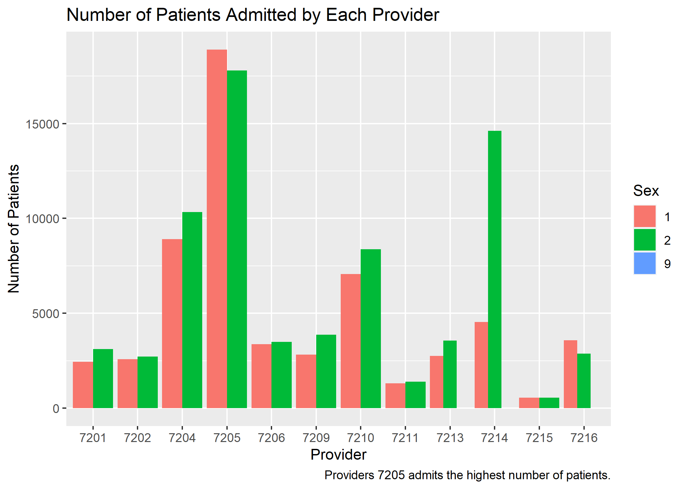

---
title: "Math421 Midterm"
author: Sophia Drezek
output:
  xaringan::moon_reader:
    lib_dir: libs
    nature:
      highlightStyle: github
      highlightLines: true
      countIncrementalSlides: false

---
# Plot 1

```{r setup, include=FALSE}
options(htmltools.dir.version = FALSE)
```

```{r xaringan-tile-view, echo=FALSE}
xaringanExtra::use_tile_view()
```


```{r xaringan-panelset, echo=FALSE}
xaringanExtra::use_panelset()
```

```{r, echo=FALSE}
xaringanExtra::use_webcam()
```

```{r xaringan-fit-screen, echo=FALSE}
xaringanExtra::use_fit_screen()
```


---
# Plot 2


---
# Plot 3

{height=20%}

---
# Plot 4


---
# Plot 5


---
# Plot 6


---
# Plot 7


---
# Plot 8


---
# Plot 9


---
# Plot 10


---
# Animated Plot


---
class: inverse, middle, center

# Model Comparisons - First target variable
Total charge - high & low

---
# Model 1 - Ranger


---
# Model 2 - Rborist


---
# Comparison


---
class: inverse, middle, center

# Model Comparisons - Second target variable
Length of stay - high & low

---
# Model 1 - Ranger


---
# Model 2 - Rborist


---
# Comparison


---
# Challenges

-Time-consuming models 

    -"Ranger"

-Errors with target variable and prediction 

    -Changed target to class 'factor'

-Creating the presentation

-Resizing the images

